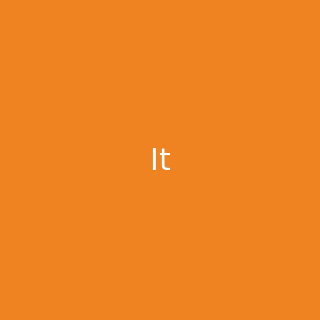

# text-meme-cli

> Generate text meme




## Install

```
$ npm install --global text-meme-cli
```


## Usage

```
$ text-meme --help

  Usage
    $ text-meme "Don't forget to be awesome"

  Options
    --delay       Frame delay [Default: 500]
    --background  Background color in hex [Default: #000000]
    --fontcolor   Text color in hex [Default: #ffffff]
    --filename    Filename without extension [Default: meme-123]
    --fontsize    Text size [Default: 30]

  Examples
    $ text-meme "Don't forget to be awesome"
    generated text-meme → meme-326.gif
    $ text-meme "Don't forget to be awesome" --filename=quote --background=#4f656d
    generated text-meme → quote.gif
```


### Related

- [text-meme](https://github.com/beatfreaker/text-meme) - API for this module
- [slate](https://github.com/bitshadow/slate) - Inspiration for this module


## License

MIT © [beatfreaker](https://beatfreaker.github.io)
